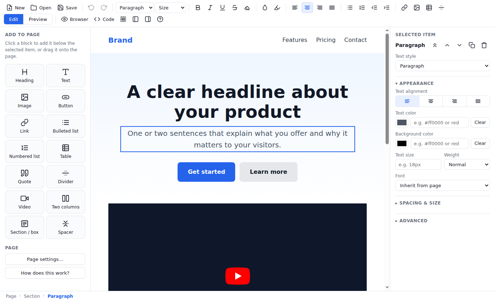

# HTML Editor

A Linux desktop app for editing HTML pages **visually, without writing code**.
Open any `.html` file, click on the text to change it, add images, buttons,
tables and videos from a panel, tweak colours and spacing with simple controls,
and save a normal HTML file that works everywhere.



## What it does

- **Edit like a document.** The page is shown exactly as a browser renders it. Click on anything and type.
- **Add blocks.** Headings, text, images, buttons, links, lists, tables, quotes, dividers, YouTube/Vimeo videos, two-column layouts, sections and spacers. Click a block to add it, or drag it to the exact spot.
- **Tweak without CSS.** Select an item and use the right-hand panel: link address, image file, alignment, colours, text size, font, padding, margins, rounded corners, borders, width/height.
- **Rearrange.** Move items up or down, duplicate, delete, or select the surrounding container.
- **Tables.** Add/remove rows and columns, toggle borders.
- **Templates.** Start from a blank page, a landing page, a blog article or a portfolio.
- **Page settings.** Title, language, background colour, text colour and font in one dialog.
- **Preview** the page in your default browser with one click.
- **Undo / redo** for everything, find text, zoom, and an optional **Code** view for the raw HTML if you ever want it.
- Your file is respected: `<head>`, stylesheets and scripts are kept as they are. Scripts inside the page never run while you edit.

## Install

### Option A: download a ready-made package (no Node.js needed)

1. Open the repository's **Actions** tab on GitHub and pick the latest "Build Linux packages" run (or click *Run workflow* to start one).
2. Download the `htmleditor-linux-packages` artifact and unzip it. It contains:
   - `htmleditor-1.0.0-amd64.deb` for Zorin OS, Ubuntu, Linux Mint, Debian and other apt-based systems.
   - `htmleditor-1.0.0-x86_64.AppImage` for any other distribution.
3. Install the `.deb` by double-clicking it, or from a terminal in the folder where you saved it:

   ```bash
   sudo apt install ./htmleditor-1.0.0-amd64.deb
   ```

   "HTML Editor" then appears in your application menu, and `.html` files get an "Open With HTML Editor" entry.

   For the AppImage: right-click it, choose Properties, allow executing it as a program, then double-click it.

Tagged releases (`v1.0.0` and so on) publish the same files on the GitHub **Releases** page.

### Option B: build the package yourself

Needs Node.js 18+ and npm (on Zorin/Ubuntu: `curl -fsSL https://deb.nodesource.com/setup_22.x | sudo -E bash - && sudo apt install nodejs`).

```bash
git clone https://github.com/usbrofficial/HTMLEDITOR.git
cd HTMLEDITOR
npm install
npm run dist
sudo apt install ./dist/htmleditor-1.0.0-amd64.deb
```

The `dist/` folder is only created by `npm run dist`; it is not part of the repository. If apt says "Unsupported file", check the exact path with `ls dist/`.

### Option C: run from source

```bash
git clone https://github.com/usbrofficial/HTMLEDITOR.git
cd HTMLEDITOR
npm install
npm start                # or: npm start -- path/to/page.html
```

To get an entry in your application menu while running from source:

```bash
./scripts/install-launcher.sh
```

## Using the editor

1. **New** starts from a template; **Open** loads an existing HTML file.
2. Click on the page and type. Use the toolbar for bold, italic, colours, alignment and lists.
3. Use **Add to page** (left) to insert blocks below the selected item, or drag a block onto the page.
4. Use **Selected item** (right) to change what you selected. Press `Esc` to select the surrounding container, `Delete` to remove a selected image, table, video or divider.
5. **Save** (Ctrl+S) writes the HTML file. **Preview** (F5) opens it in your browser.

Images you pick from your computer are linked with a relative path when the page has been saved. If the page is still untitled they are embedded in the page instead, so nothing breaks; save the page first if you would rather link to the files.

Press **F1** inside the app for a short guide, and see *Help → Keyboard Shortcuts* for the full list.

## Development

```bash
npm install     # installs Electron and electron-builder
npm start       # run the app
npm test        # smoke test: launches the real app under Xvfb and exercises editing, undo, code view and saving
npm run icon    # re-render build/icon.png from build/icon.svg (needs Playwright)
npm run dist    # build AppImage + .deb into dist/ (also done by the GitHub Actions workflow)
```

Project layout:

```
main.js            Electron main process: window, menu, file dialogs, IPC
preload.js         The small API exposed to the UI (open/save/pick image/…)
src/index.html     Editor layout and dialogs
src/style.css      Editor styling
src/editor.js      Visual editing logic (selection, blocks, properties, undo, serialisation)
src/templates.js   Starter page templates
src/icons.js       Inline SVG icons
build/             App icon
scripts/           Helper scripts (launcher install, icon rendering)
test/              Smoke test
```

The edited page lives in a sandboxed iframe: its scripts are disabled while editing, its stylesheets apply normally, and relative paths resolve against the file's folder. On save the document is serialised back with all editor markup removed.

## License

MIT
